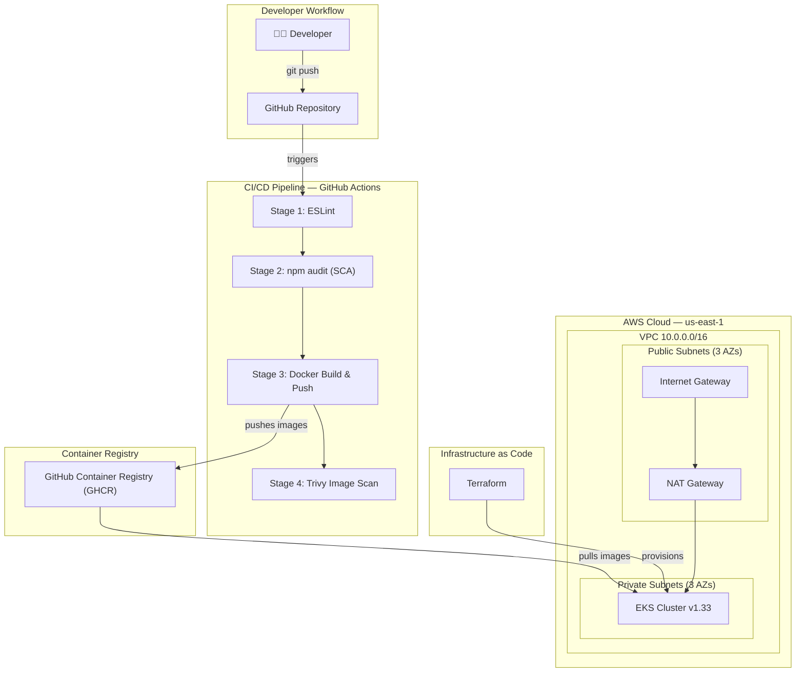
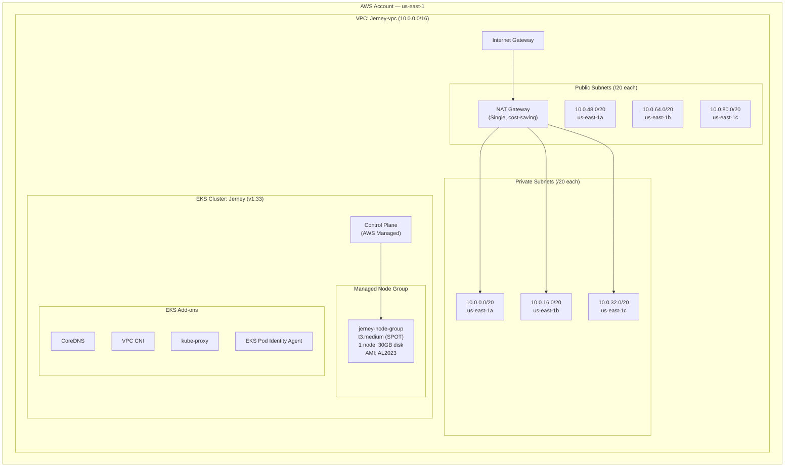
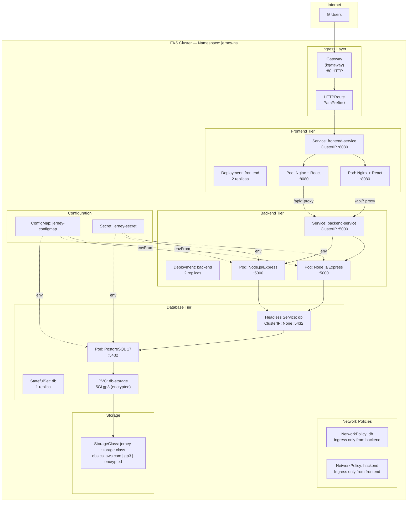
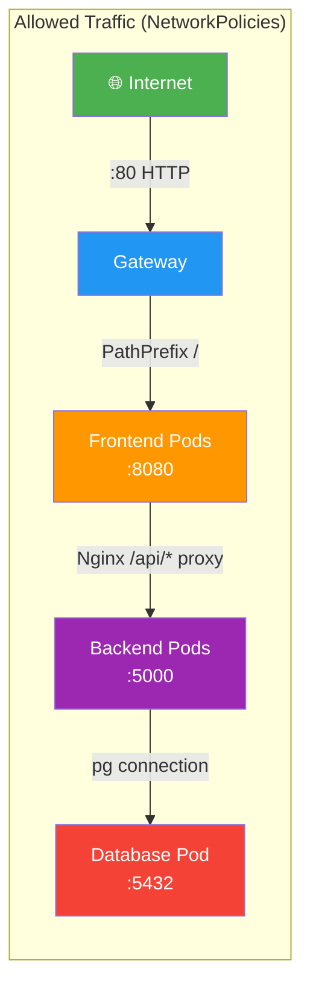
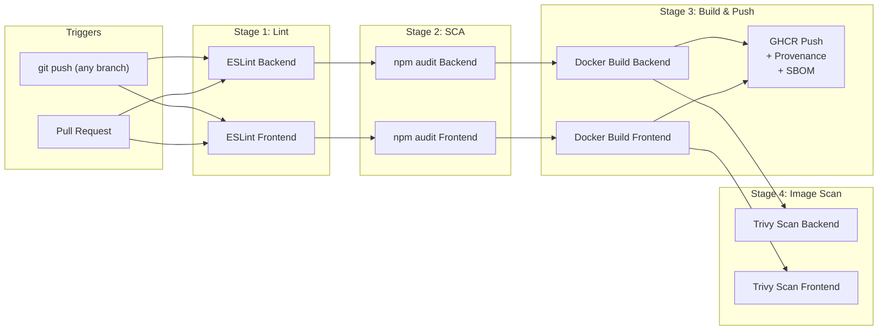
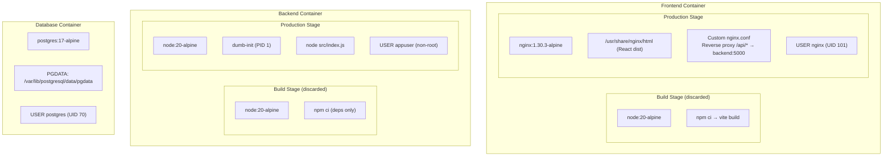
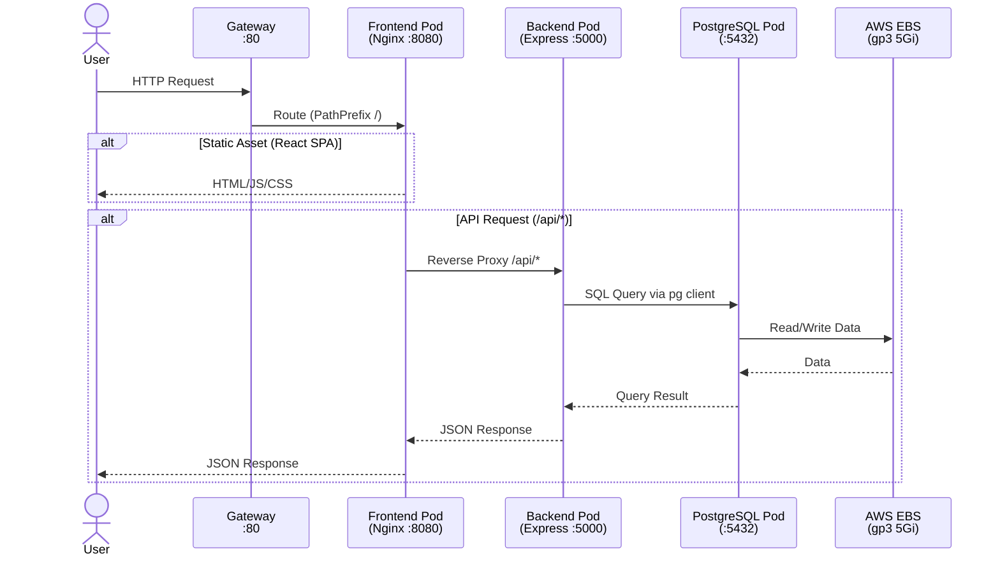
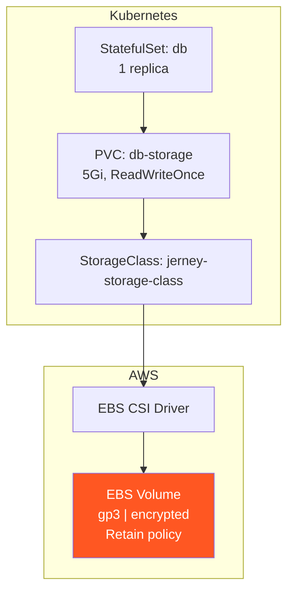
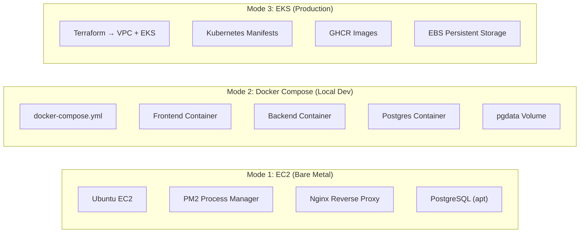

# Jerney — Complete Infrastructure Architecture

> **Project**: Jerney Blog Platform — A 3-tier web application deployed on AWS EKS using Terraform, Kubernetes, and GitHub Actions CI/CD.

---

## 1. High-Level Architecture Overview



---

## 2. AWS Cloud Infrastructure (Terraform Layer)

> Provisioned via [terraform/](file:///home/ubuntu/Jerney/terraform) using official AWS modules.



### Terraform Configuration Summary

| Resource | Source | Key Settings |
|---|---|---|
| **VPC** | `terraform-aws-modules/vpc/aws` | 3 AZs, NAT Gateway (single), public/private subnets |
| **EKS** | `terraform-aws-modules/eks/aws` v21 | K8s v1.33, managed node group, SPOT instances |
| **Subnets** | Auto-calculated via `cidrsubnet()` | `/20` blocks → 4096 IPs each |
| **Provider** | `hashicorp/aws` v6.0 | Region: `us-east-1` |

### Key Design Decisions (Interview Talking Points)

- **Single NAT Gateway**: Cost optimization for dev. Production should use one per AZ for HA.
- **SPOT instances**: 60-90% cost savings. Acceptable for dev workloads.
- **Private subnets for nodes**: Worker nodes and control plane both in private subnets. External access via Gateway API.
- **Subnet tagging**: `kubernetes.io/role/elb` and `kubernetes.io/role/internal-elb` tags enable auto-discovery by AWS Load Balancer Controller.
- **Public endpoint**: `endpoint_public_access = true` for kubectl access from outside VPC.

---

## 3. Kubernetes Architecture (Application Layer)

> All manifests live in [kubernetes/](file:///home/ubuntu/Jerney/kubernetes) — namespace: `jerney-ns`



### Kubernetes Resources Breakdown

| # | Resource | File | Details |
|---|---|---|---|
| 1 | **Namespace** | [01-namespace.yml](file:///home/ubuntu/Jerney/kubernetes/01-namespace.yml) | `jerney-ns` with label `app.kubernetes.io/part-of: jerney` |
| 2 | **ConfigMap** | [02-configmap.yml](file:///home/ubuntu/Jerney/kubernetes/02-configmap.yml) | `POSTGRES_DB`, `DB_HOST`, `PORT`, `DB_NAME`, `DB_PORT` |
| 3 | **Secret** | [03-secrets.yml](file:///home/ubuntu/Jerney/kubernetes/03-secrets.yml) | `POSTGRES_USER/PASSWORD`, `DB_USER/PASSWORD` (base64 Opaque) |
| 4 | **Frontend Deployment** | [04-frontend-deployment.yml](file:///home/ubuntu/Jerney/kubernetes/04-frontend-deployment.yml) | 2 replicas, Nginx serving React, `:8080`, non-root (UID 101) |
| 5 | **Backend Deployment** | [05-backend-deployment.yml](file:///home/ubuntu/Jerney/kubernetes/05-backend-deployment.yml) | 2 replicas, Node.js/Express, `:5000`, non-root (UID 1000), readOnlyRootFilesystem |
| 6 | **Frontend Service** | [06-frontend-service.yml](file:///home/ubuntu/Jerney/kubernetes/06-frontend-service.yml) | ClusterIP `:8080` |
| 7 | **Backend Service** | [07-backend-service.yml](file:///home/ubuntu/Jerney/kubernetes/07-backend-service.yml) | ClusterIP `:5000` |
| 8 | **DB StatefulSet** | [08-statefulset.yml](file:///home/ubuntu/Jerney/kubernetes/08-statefulset.yml) | 1 replica, PostgreSQL 17-alpine, `:5432`, PVC 5Gi |
| 9 | **DB Headless Service** | [09-statefulSet-service.yml](file:///home/ubuntu/Jerney/kubernetes/09-statefulSet-service.yml) | `clusterIP: None` — stable DNS: `db-statefulset-0.db.jerney-ns.svc.cluster.local` |
| 10 | **StorageClass** | [10-storageClass.yml](file:///home/ubuntu/Jerney/kubernetes/10-storageClass.yml) | `ebs.csi.aws.com`, gp3, encrypted, Retain, WaitForFirstConsumer |
| 11 | **Gateway** | [11-gateway.yml](file:///home/ubuntu/Jerney/kubernetes/11-gateway.yml) | Gateway API (kgateway), HTTP `:80` |
| 12 | **HTTPRoute** | [12-http-routes.yml](file:///home/ubuntu/Jerney/kubernetes/12-http-routes.yml) | PathPrefix `/` → `frontend-service:8080` |
| 13 | **DB NetworkPolicy** | [13-networkPolicyDB.yml](file:///home/ubuntu/Jerney/kubernetes/13-networkPolicyDB.yml) | DB accepts ingress only from backend pods on `:5432` |
| 14 | **Backend NetworkPolicy** | [14-networkPolicyBackend.yml](file:///home/ubuntu/Jerney/kubernetes/14-networkPolicyBackend.yml) | Backend accepts ingress only from frontend pods on `:5000` |

---

## 4. Network Security & Traffic Flow



### Network Security Rules

| Policy | Target Pods | Allowed Source | Port | Effect |
|---|---|---|---|---|
| `backend-network-policy` | `backend-deployment` | Only `frontend-deployment` pods | TCP `5000` | **Backend is isolated** — no direct internet access |
| `db-network-policy` | `db-statefulset` | Only `backend-deployment` pods | TCP `5432` | **DB is fully isolated** — only backend can reach it |

> [!IMPORTANT]
> **Interview Key Point**: This implements a **zero-trust, defense-in-depth** networking model. Even if an attacker compromises the frontend pod, they cannot directly reach the database — they must go through the backend, and the backend has `readOnlyRootFilesystem: true`.

---

## 5. CI/CD Pipeline (GitHub Actions)

> Defined in [cicd.yml](file:///home/ubuntu/Jerney/.github/workflows/cicd.yml)



### Pipeline Stages Detail

| Stage | Tool | Purpose | Fail Behavior |
|---|---|---|---|
| **1. Lint** | ESLint | Code quality & style enforcement | `continue-on-error: true` |
| **2. SCA** | `npm audit` | Dependency vulnerability scan (HIGH+) | Warns but continues |
| **3. Build** | Docker Buildx + GHCR | Multi-tag build (SHA, branch, latest), GHA layer caching | Blocks on failure |
| **4. Image Scan** | Trivy | Container CVE scan (CRITICAL, HIGH) | `continue-on-error: true` |

### Docker Image Tags Strategy

```
ghcr.io/pawarhimanshu934/jerney/jerney-frontend:abc1234    # SHA-based (immutable)
ghcr.io/pawarhimanshu934/jerney/jerney-frontend:main       # Branch-based (mutable)
ghcr.io/pawarhimanshu934/jerney/jerney-frontend:latest     # Only on default branch
```

### Supply Chain Security

- **Provenance**: Cryptographic attestation of build origin (who, when, where).
- **SBOM**: Full software bill of materials embedded in image (OS packages + npm deps).
- **GHA Cache**: Bidirectional Docker layer caching via `cache-from/cache-to: type=gha`.

---

## 6. Container Architecture (Docker)



### Docker Security Hardening

| Practice | Frontend | Backend | Database |
|---|---|---|---|
| **Multi-stage build** | ✅ | ✅ | N/A (official image) |
| **Non-root user** | ✅ `nginx` (101) | ✅ `appuser` (1000) | ✅ `postgres` (70) |
| **Read-only rootfs** | ❌ (Nginx needs cache) | ✅ | ❌ (Postgres needs write) |
| **dumb-init (PID 1)** | ❌ (Nginx is init-safe) | ✅ | ❌ (Postgres is init-safe) |
| **Alpine base** | ✅ | ✅ | ✅ |
| **`allowPrivilegeEscalation: false`** | ✅ | ✅ | ✅ |

---

## 7. Application Data Flow



---

## 8. Storage Architecture



| Setting | Value | Why |
|---|---|---|
| **Provisioner** | `ebs.csi.aws.com` | AWS EBS CSI driver for dynamic provisioning |
| **Type** | `gp3` | Better price-performance than gp2 (3000 IOPS baseline) |
| **Encrypted** | `true` | Data at rest encryption via AWS KMS |
| **ReclaimPolicy** | `Retain` | Prevents accidental data loss on PVC deletion |
| **VolumeBindingMode** | `WaitForFirstConsumer` | Ensures EBS volume is created in the same AZ as the pod |
| **AccessMode** | `ReadWriteOnce` | Single-node attachment (EBS limitation) |

---

## 9. Deployment Modes Summary

The project supports **3 deployment modes**:



| Mode | Entry Point | Use Case | Orchestration |
|---|---|---|---|
| **EC2 Bare Metal** | [deploy/setup.sh](file:///home/ubuntu/Jerney/deploy/setup.sh) | Quick demo / single server | PM2 + Nginx + PostgreSQL (apt) |
| **Docker Compose** | [docker-compose.yml](file:///home/ubuntu/Jerney/docker-compose.yml) | Local development | Docker Compose (3 services) |
| **EKS (Production)** | [terraform/](file:///home/ubuntu/Jerney/terraform) + [kubernetes/](file:///home/ubuntu/Jerney/kubernetes) | Production / Scalable | Terraform + Kubernetes |

---

## 10. Security Summary (Interview Cheat Sheet)

### At Every Layer

| Layer | Security Controls |
|---|---|
| **CI/CD** | ESLint, npm audit (SCA), Trivy image scanning, Provenance, SBOM |
| **Container** | Multi-stage builds, non-root users, Alpine base, dumb-init, read-only rootfs |
| **Kubernetes** | `runAsNonRoot`, `readOnlyRootFilesystem`, `allowPrivilegeEscalation: false`, `automountServiceAccountToken: false` |
| **Networking** | NetworkPolicies (DB ← Backend only, Backend ← Frontend only), ClusterIP services (no NodePort/LB exposure) |
| **Storage** | EBS encryption at rest, Retain reclaim policy |
| **Nginx** | Security headers (X-Frame-Options, X-Content-Type-Options, X-XSS-Protection, Referrer-Policy), dotfile blocking |
| **Secrets** | K8s Secrets (base64 Opaque), injected via env vars (not mounted files) |

---

## 11. Tech Stack Quick Reference

| Component | Technology | Version |
|---|---|---|
| **Frontend** | React + Vite + Nginx | React 18, Vite 5, Nginx 1.30 |
| **Backend** | Node.js + Express | Node 20, Express 4.21 |
| **Database** | PostgreSQL | 17 (Alpine) |
| **IaC** | Terraform | ≥ 1.2, AWS Provider v6 |
| **Container Runtime** | Docker (multi-stage) | Alpine-based |
| **Orchestration** | AWS EKS (Managed K8s) | v1.33 |
| **CI/CD** | GitHub Actions | Reusable matrix strategy |
| **Registry** | GitHub Container Registry (GHCR) | OCI-compliant |
| **Ingress** | Kubernetes Gateway API (kgateway) | v1 |
| **Security Scanning** | Trivy, ESLint, npm audit | Latest |

---

## 12. Repository Structure Map

```
Jerney/
├── .github/workflows/
│   └── cicd.yml                    # CI/CD Pipeline (Lint → SCA → Build → Scan)
├── backend/
│   ├── Dockerfile                  # Multi-stage: node:20-alpine → dumb-init
│   ├── src/
│   │   ├── index.js                # Express server entry point
│   │   ├── db.js                   # PostgreSQL connection (pg client)
│   │   └── routes/                 # API route handlers
│   └── package.json                # express, pg, cors, dotenv
├── frontend/
│   ├── Dockerfile                  # Multi-stage: node:20-alpine → nginx:1.30-alpine
│   ├── nginx.conf                  # SPA routing + /api/* reverse proxy
│   ├── src/                        # React components
│   └── package.json                # react, react-router-dom, axios
├── terraform/
│   ├── vpc.tf                      # VPC, 3 AZs, public/private subnets, NAT
│   ├── eks.tf                      # EKS cluster, managed node group (SPOT)
│   ├── variable.tf                 # cluster_name, version, region, CIDR
│   ├── output.tf                   # VPC ID, subnets, cluster endpoint
│   └── terraform.tf                # AWS provider v6, Terraform ≥ 1.2
├── kubernetes/
│   ├── 01-namespace.yml            # jerney-ns
│   ├── 02-configmap.yml            # Non-sensitive config
│   ├── 03-secrets.yml              # DB credentials (base64)
│   ├── 04-frontend-deployment.yml  # 2 replicas, Nginx+React
│   ├── 05-backend-deployment.yml   # 2 replicas, Express API
│   ├── 06-frontend-service.yml     # ClusterIP :8080
│   ├── 07-backend-service.yml      # ClusterIP :5000
│   ├── 08-statefulset.yml          # PostgreSQL, PVC, health probes
│   ├── 09-statefulSet-service.yml  # Headless service for DNS
│   ├── 10-storageClass.yml         # EBS CSI, gp3, encrypted
│   ├── 11-gateway.yml              # Gateway API entry point
│   ├── 12-http-routes.yml          # Route to frontend
│   ├── 13-networkPolicyDB.yml      # DB ← Backend only
│   └── 14-networkPolicyBackend.yml # Backend ← Frontend only
├── deploy/
│   ├── setup.sh                    # EC2 bare-metal setup script
│   └── jerney-nginx.conf           # Nginx config for EC2 mode
└── docker-compose.yml              # Local dev (3 services)
```

---

> [!TIP]
> **Interview Pro Tip**: When explaining this architecture, walk through it layer by layer: **Terraform provisions the infra** → **GitHub Actions builds & secures the images** → **Kubernetes orchestrates the workload** → **NetworkPolicies enforce zero-trust** → **StorageClass provides persistent encrypted storage**. This shows you understand the full DevOps lifecycle from code commit to production.
